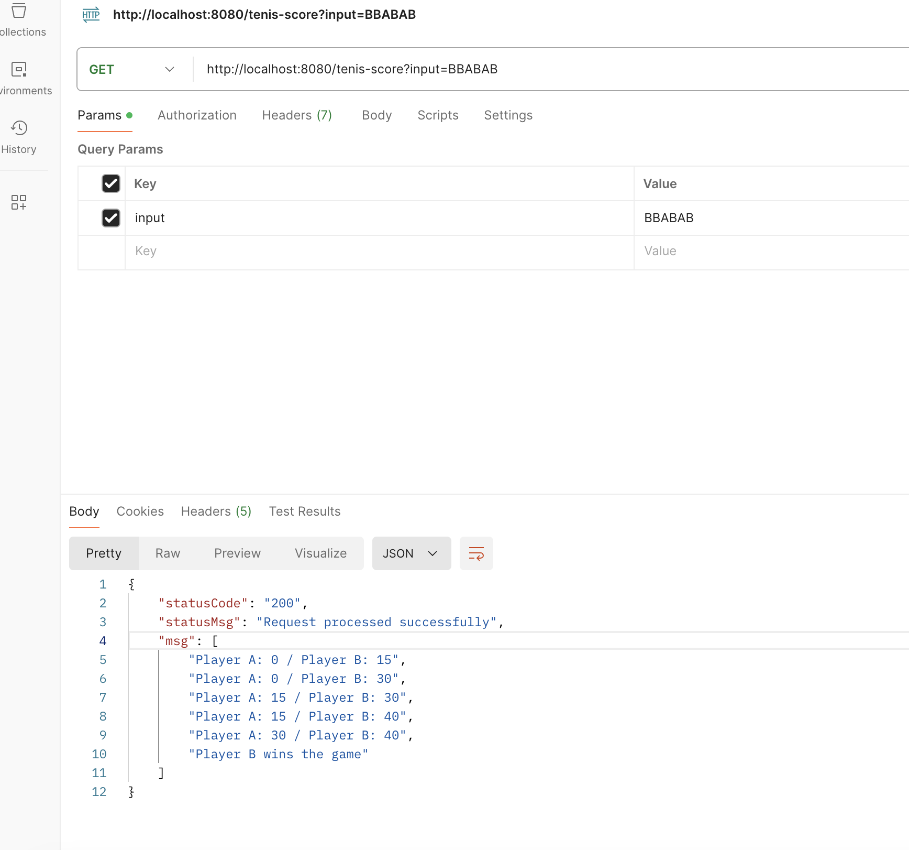

# Tenis Project: BforBank
### Description
Ce projet implémente un système de calcul de score pour un jeu de tennis simple en utilisant Java 21 et Spring Boot. L'objectif est de simuler les règles de base du tennis et de déterminer le score après chaque point gagné, ainsi que de déclarer le gagnant du jeu. Le projet utilise un design pattern basé sur l'état pour gérer les transitions de score et les règles spéciales comme l'égalité ("deuce") et l'avantage.

### Fonctionnalités
* Calcul du score de tennis selon les règles officielles.
* Gestion des états de jeu: Score normal, Deuce, Avantage, et Victoire.
* Gestion des  null-safe.
* Gestion des erreurs @ExceptionHandler
* Utilisation du design patern state.
* Découpage modulaires des fonctionnalités
* Tests unitaires et integration pour valider la logique de calcul de score.

### Prérequis
* Java 21 : Assurez-vous que Java 21 est installé sur votre machine.
* Maven 3.8+ : Pour la gestion des dépendances et le build du projet.
* Spring Boot 3.3.3 : Utilisé pour le cadre du projet et l'injection de dépendances.

### Structure du Projet

   
   
  
   Pour concevoir cette application avec une bonne séparation des fonctionnalités et en utilisant les principes du design pattern, nous pouvons opter pour le Pattern State. Ce pattern est idéal ici car le jeu de tennis passe par plusieurs états (normal, deuce, avantage, victoire). Chaque état peut être représenté comme un objet différent qui gère la logique de transition vers l'état suivant.


### Explication des Dossiers
* src/main/java/com/example/tennis/ : Contient le code source principal.

  * config/ : Configuration du jeu.
  * controller/ : Exposition  d'un enpoint "tennis-score".
  * service/ : Contient la logique métier principale pour le calcul du score de tennis.
  * state/ : Implémentations des différents états du jeu de tennis.
  * TennisScoreApplication.java : Classe principale pour démarrer l'application Spring Boot.
* src/main/resources/ : Contient les fichiers de configuration et d'images.

  * application.properties : Fichier de configuration principal de Spring Boot.
  * asset : folder image.
src/test/: Tests unitaires pour vérifier le comportement de l'application et integration.

* pom.xml : Fichier de configuration Maven.

* README.md : Documentation du projet.
## Installation et Configuration
###  Cloner le Répertoire
* Clonez le projet depuis le dépôt Git:
 ``` 
 git clone https://github.com/Diags/tenis-score.git
 cd tenis-score
```
### Construire le Projet
Utilisez Maven pour construire le projet:
 ``` 
 mvn clean install

  ``` 

### Exécuter les Tests
Pour exécuter les tests unitaires, utilisez la commande suivante:
 ``` 
mvn test
 ``` 


### Démarrer l'Application
Pour démarrer l'application Spring Boot, exécutez:
 ``` 
mvn spring-boot:run
 ``` 
Alternativement, vous pouvez exécuter l'application directement avec Java après avoir construit le projet:
 ```  
 java -jar target/tennis-score-0.0.1-SNAPSHOT.jar
  ``` 
## Utilisation
### Lancer une Simulation de Jeu
Une fois l'application démarrée, vous pouvez simuler un jeu de tennis en appelant la méthode play du TennisGameService avec une chaîne de caractères représentant les points gagnés par les joueurs. Par exemple:
  ``` 
  curl "http://localhost:8080/tenis-score?input=ABABAA"

  ``` 
### Exemple de Sortie
Pour l'entrée "ABABAA", la sortie sera:
``` 
Player A: 15 / Player B: 0
Player A: 15 / Player B: 15
Player A: 30 / Player B: 15
Player A: 30 / Player B: 30
Player A: 40 / Player B: 30
Player A wins the game
``` 
   
   
   
```

  Test d'un argument contenant des chiffres.

``` 
 
 
 ``` 

# INFOS UTILS
### SWAGGER
``` 
 http://localhost:8080/swagger-ui/index.html#/Tenis%20score%20API
``` 


### Wikipedia:
https://en.wikipedia.org/wiki/Tennis#Scoring
 pour les règles de tennis
